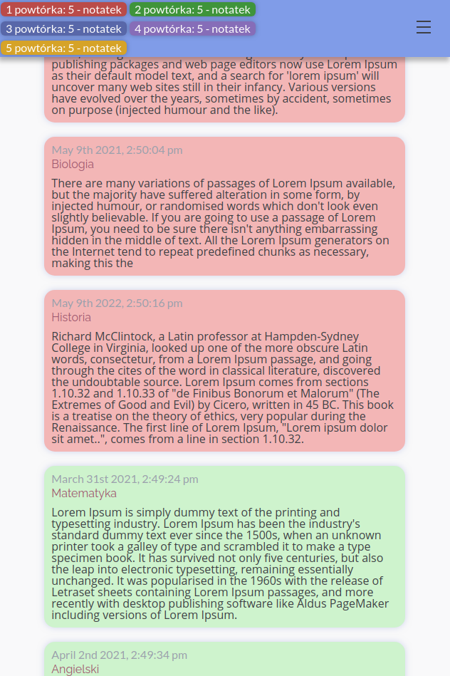
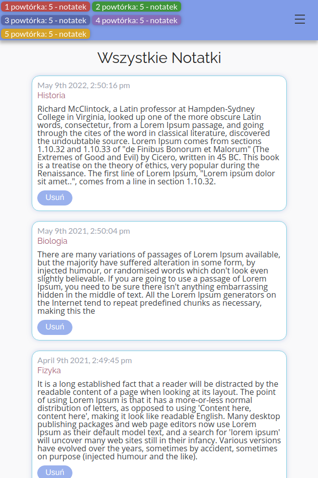

# Witaj w moim magicznym notatniku! 

## 🐶 Wersja demo

```Kliknij w link:``` https://dominikdoms.github.io/ProjektKoncowy/#/home


> **Opis**: Aplikacja przeznaczona dla ludzi uczących się, której celem jest rozwiązanie problemu zapominania zdobytej wiedzy.  
> Dzięki wykorzystanej krzywej zapamiętywania z funkcją powiadamiania o N-tych powtórkach, po upływie 10min, 2 dni, tygodniu, miesiącu, roku. 
> Urzytkownik zapamięta 100% nowego materiału.

## ⏳ Powtórki 

## 📖 Wszystkie dodane notatki


## 💥 Aplikacja

* Landing page
* Dodawanie notatek
* Sekcja powtórek
* Wszystkie notatki

## 👌 Funkcje
* Responsive Web Design (RWD)
* Wszystkie notatki zapisują się w JSON-server


## 📓 Użyte technologie:

- Create React App
- React
- React Router
- React Hooks
- SASS
- JSON-server
- RWD
- React Router
- Fetch


## ⬇ Jak zainstalować:
1. ``` git clone https://github.com/Dominikdoms/ProjektKoncowy.git ```
2. ```  cd my-app ```
3. ``` npm i ```
4. ``` json-server db.json --watch ```
5. Otwórz drugi terminal i wpisz: ``` npm start ```